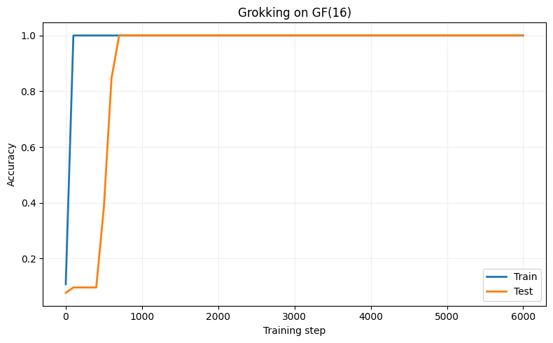
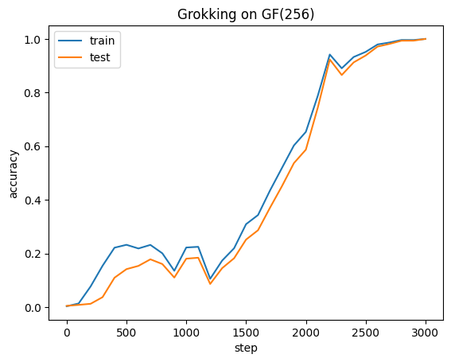
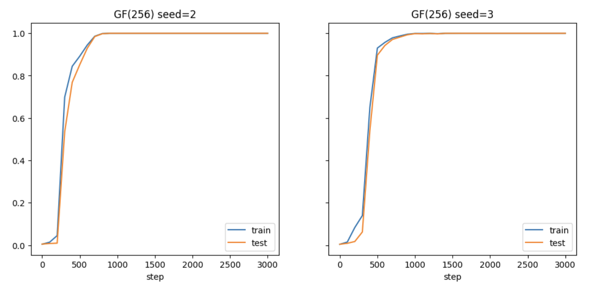
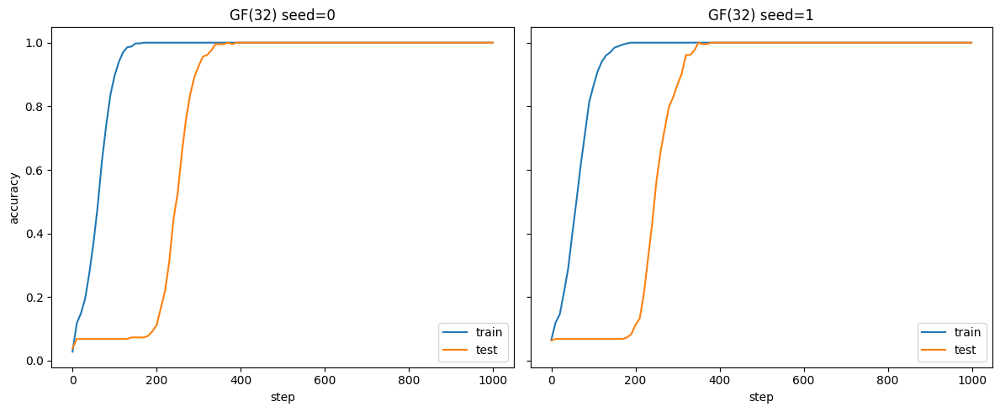
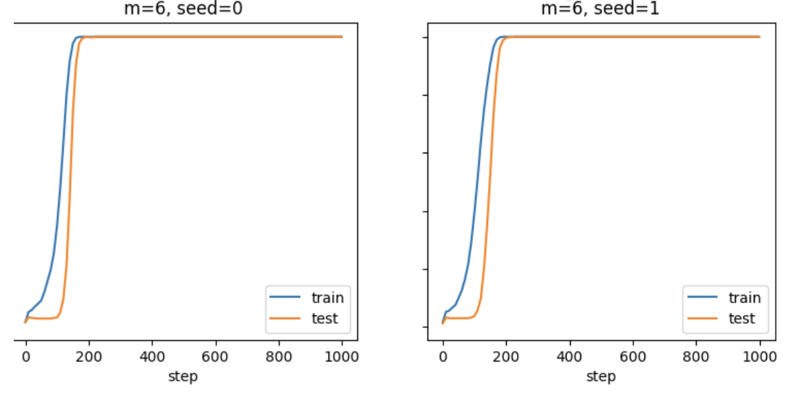
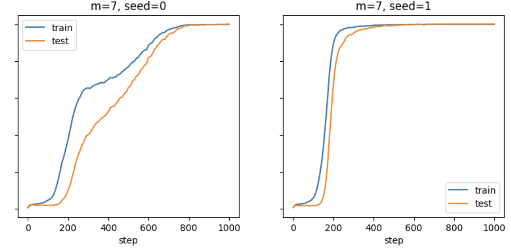
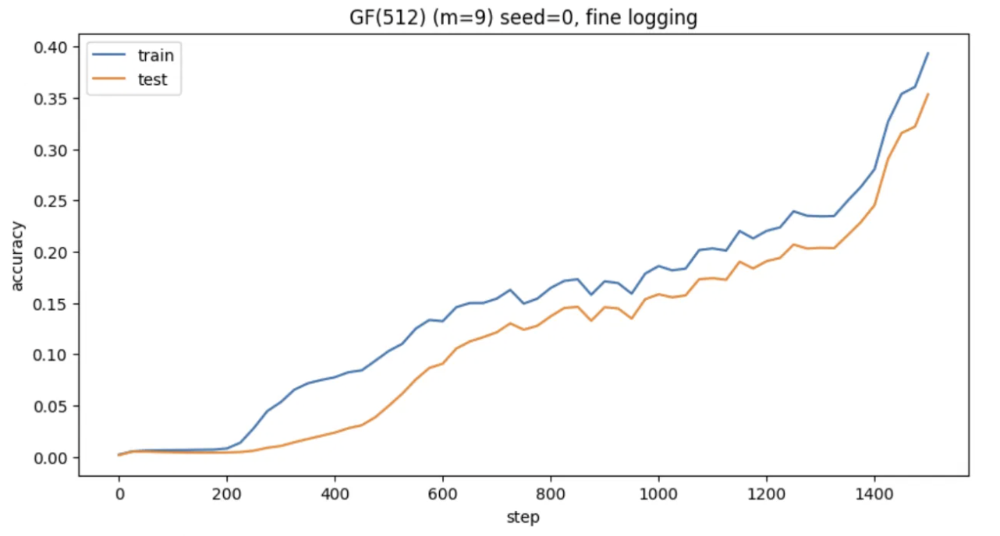

# GF(2^m) Multiplication: Does a Neural Network Rediscover the Log-Table Trick?

Investigating whether small neural networks rediscover the discrete-log/log-antilog
algorithm for multiplication in GF(2^m), with experiments on grokking and
mechanistic structure.

## Motivation

Neural networks trained on simple algebraic tasks have been shown to rediscover
known algorithms after a delayed generalization phase known as "grokking." A
canonical example: small transformers trained on modular addition (mod p) learn
to represent numbers as points on a circle and implement addition via rotation
(Nanda et al., 2023) — a "Clock" circuit.

GF(2^m), the Galois field with 2^m elements, is the exact algebraic structure
underlying AES encryption and Reed-Solomon error-correcting codes. Real hardware
implements GF(2^m) multiplication efficiently using a **log/antilog (discrete-log)
table**: convert each element to its discrete logarithm with respect to a
primitive element, add the logs, convert back — turning multiplication into
addition on a cyclic group of order 2^m - 1.

This project asks: if a small transformer is trained purely on (a, b) -> a*b
examples in GF(2^m), with no hint of logs, primitive elements, or cyclic
structure, does it independently discover this same trick?

## Repository structure

- `dataset.py` — generates the full GF(2^m) multiplication table for any field size
- `model.py` — small transformer (Nanda-style architecture)
- `train.py` — training loop, chunked for memory safety at large field sizes
- `experiments/run_gf16.py` — trains and plots the GF(16) baseline result
- `experiments/run_gf256.py` — trains and plots the first GF(256) result
- `experiments/run_gf256_seeds_2_3.py` — two additional GF(256) seeds, confirming the pattern
- `experiments/run_gf32_64_128_sweep.py` — grokking-gap sweep across GF(32), GF(64), GF(128), two seeds each
- `experiments/run_gf512_partial.py` — partial (unconverged) check at GF(512)
- `analysis/check_gf16_clock_pattern.py` — tests input embeddings for Nanda-style circular structure
- `analysis/check_gf16_logsum_frequencies.py` — tests output logits for causal log-sum frequency structure (Fourier + ablation)
- `analysis/logsum_dependence.py` — direct test of output dependence on log(a)+log(b); generalized to run at any field size
- `results/` — saved plots from each experiment

## Result 1: GF(16) groks, and its behavior matches the log-table structure

Training a small transformer on the complete GF(16) multiplication table
(`experiments/run_gf16.py`, weight_decay=5.0, train_frac=0.8) produces a clean,
classic grokking curve: training accuracy saturates almost immediately, test
accuracy stays near chance for several hundred steps, then rises sharply to
match training accuracy. This is reproducible across multiple random seeds.

Three analyses tested whether the trained model's internal structure matches the
discrete-log/log-table trick:

**`check_gf16_clock_pattern.py` (negative result):** Following Nanda et al.'s
finding that modular addition induces circular embeddings, this checks whether
GF(16) element embeddings, reordered by discrete log, show a concentrated
Fourier signature (as a "Clock" circuit would). Result: no such structure. 
Power is spread roughly evenly across frequencies in both natural and
discrete-log order (top-2 concentration ~0.16 either way).

**`check_gf16_logsum_frequencies.py` (positive, causal result):** Rather than
the input embeddings, this examines the model's actual output behavior, the
full grid of output logits, indexed by log(a) and log(b). This grid shows real
frequency concentration in discrete-log order (~40% of power in the top 4
frequencies) versus natural order (~8.7%). Critically, removing the dominant
frequencies causally collapses accuracy (100% -> ~4% at k=16 frequencies
removed), while removing an equal number of random frequencies leaves accuracy
untouched (100% throughout). This confirm that the  structure is load-bearing, not
incidental.

**`logsum_dependence.py` (direct confirmation):** The log-table hypothesis makes
a precise, falsifiable prediction: output should depend only on
`(log(a) + log(b)) mod 15`, not on a and b individually. Grouping all 225
nonzero pairs by their log-sum and measuring within-group variance gives a
ratio of ~4.6-6.2% (consistent across 3 independently trained seeds) versus
~93.9-99.6% for a random-grouping control i.e., knowing only the log-sum
explains nearly all of the model's output variation.

**Conclusion:** although GF(16)'s raw input embeddings show no obvious
discrete-log structure, the model's actual input-output behavior is strongly,
causally, and reproducibly consistent with having learned the log-table trick.

**Note on scope:** `check_gf16_clock_pattern.py` and
`check_gf16_logsum_frequencies.py` were run only at GF(16). The Clock-pattern
test is a narrow check of one specific implementation and was superseded by the
more general tests once it returned negative; the frequency-ablation test is
computationally heavier to scale to larger fields (a full per-class 2D FFT and
ablation sweep). `logsum_dependence.py`, the most direct and cheapest test of
the core hypothesis, was instead run across every field size tested, to check
whether the finding holds as field size grows.

## Result 2: the same log-table structure holds at GF(256), the real AES field size

`experiments/run_gf256.py` trains the same model on GF(256) — the actual field
size used by AES and most Reed-Solomon implementations. The first run (seed=0)
converged cleanly, but its training curve looked qualitatively different from
GF(16): train and test accuracy rose together throughout, with no long
memorization plateau i.e., no classic grokking.

Running `logsum_dependence.py` on this model showed the log-sum structure holds
here too, and even more cleanly than at GF(16): a ratio of ~0.79-0.9% versus a
~99.6% random control.

`experiments/run_gf256_seeds_2_3.py` reran two more seeds to check
reproducibility. Both converged and showed the same qualitative pattern as
seed=0 — train and test rising together, with only a small, brief lag
(max gap ~0.08-0.12) rather than a sustained plateau.

## Result 3: how the grokking gap changes with field size

To understand whether GF(256)'s smooth generalization was a sudden change or
part of a gradual trend, we swept field size m=4 through m=9.

**Findings, two seeds per field size unless noted:**
- **m=4 (GF16), m=5 (GF32):** clear, dramatic grokking, long flat plateau in
  test accuracy, then a sharp jump. Consistent across seeds.

  
  
- **m=6 (GF64), m=7 (GF128):** also clear grokking, comparable in character
  to m=4/m=5. (One m=7 seed showed an interesting two-stage climb, suggesting
  a possible intermediate/partial solution before full convergence; noted but
  not further investigated.)

  
  

- **m=8 (GF256):** the gap shrinks substantially. All three seeds tested
  converged cleanly and showed only a small, brief train/test lag rather than
  a sustained plateau.

  
  
- **m=9 (GF512):** `experiments/run_gf512_partial.py`, a partial,
  unconverged check (1500 steps, final train/test accuracy ~39%/35%). The
  shape so far shows train and test rising almost together, with a small,
  fairly steady gap (~0.05), consistent with the shrinking-gap trend
  continuing, but not confirmed to convergence.

  

**Overall interpretation:** the grokking gap is strong and consistent for
m=4-7, then shrinks substantially starting at m=8, with m=9's partial data
consistent with further shrinkage. This is consistent with the standard
account of why grokking happens: a model can easily memorize a small training
set before weight decay forces it toward the generalizing solution; as the
dataset grows (256 pairs at m=4 vs. 65,536 pairs at m=8), full memorization
becomes harder and slower, naturally narrowing the window in which a
memorize-then-generalize split can occur.

